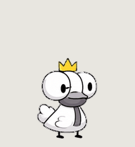
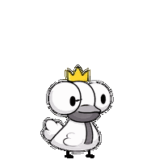
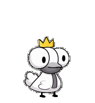
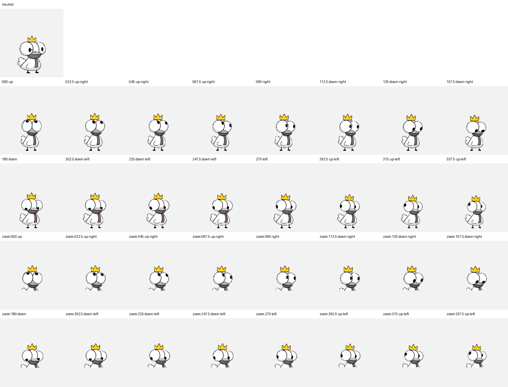

<div align="center">



<h1>Woofy Goopy</h1>

<p><strong>A small pigeon digital pet for ChatGPT Work, Codex, and Win/mac/xfce.</strong></p>
<p><em>Absolute pigeon scholar.</em></p>

<p>
  <a href="https://chatgpt.com/s/sharepet_6a9a21be29048191a5b59622cd3cd26a">
    
  </a>
  <a href="./assets/spritesheet.png">
    
  </a>
  <a href="./electron">
    
  </a>
</p>


</div>

<br>

Woofy Goopy turns agent activity into a visible character state. It works while a task is running, waits when input is required, reacts to failure, reviews completed work, and follows the pointer when idle. The artwork, animation contract, browser runtime, and Electron shell remain separate, so the same character can move between supported hosts without rebuilding the animation system.

## Add to ChatGPT Work

<div align="center">

### [Add Woofy Goopy →](https://chatgpt.com/s/sharepet_6a9a21be29048191a5b59622cd3cd26a)

Open the shared pet page and confirm the import.

</div>

For supported Codex desktop clients, the immutable v2 install URI is:

```text
codex://pets/install?name=Woofy%20Goopy&imageUrl=https%3A%2F%2Fraw.githubusercontent.com%2FSamwang-afk%2Fwoofy-goopy%2F65f8e576f3d43af9823ede21f7843b0387832a42%2Fassets%2Fspritesheet.png&description=Absolute%20pigeon%20scholar.&spriteVersionNumber=2
```

After installation, select Woofy Goopy from **Settings → Pets** in the ChatGPT desktop app, or enter `/pets` in an interactive Codex CLI session. Availability depends on the client, account, and workspace. The Codex IDE extension does not currently provide the pet picker or floating overlay.

Official references: [Pets](https://learn.chatgpt.com/docs/pets) · [Pet install links](https://learn.chatgpt.com/docs/reference/commands#pets)

## Character states

<table>
  <tr>
    <th>Idle</th>
    <th>Working</th>
    <th>Needs input</th>
  </tr>
  <tr>
    <td align="center"></td>
    <td align="center"></td>
    <td align="center"></td>
  </tr>
  <tr>
    <th>Reviewing</th>
    <th>Failed</th>
    <th>Waving</th>
  </tr>
  <tr>
    <td align="center"></td>
    <td align="center"></td>
    <td align="center"></td>
  </tr>
  <tr>
    <th>Jumping</th>
    <th>Moving left</th>
    <th>Moving right</th>
  </tr>
  <tr>
    <td align="center"></td>
    <td align="center"></td>
    <td align="center"></td>
  </tr>
</table>

The final two atlas rows provide sixteen clockwise gaze directions at 22.5° intervals.

<p align="center">
  
</p>

## One character, several hosts

| Host | Included integration | Intended use |
|---|---|---|
| **ChatGPT Work** | Shared-pet import and official v2 atlas | Activity companion inside supported Work interfaces |
| **Codex** | Install URI and CLI-compatible state set | Running, waiting, ready, and blocked task feedback |
| **Electron** | Transparent always-on-top window | Standalone Windows and macOS companion |
| **Web / Canvas** | Dependency-free `PetPlayer` | Embed the animation in another application |

## Run the desktop example

Requires Node.js and npm.

```bash
git clone https://github.com/Samwang-afk/woofy-goopy.git
cd woofy-goopy
npm install --save-dev electron
npm start
```

The example includes pointer tracking, state controls, click-to-jump, reduced-motion support, a draggable region, and a constrained preload interface. It is an integration reference rather than a signed desktop release; transparency, display scaling, and always-on-top behavior should be verified on each target platform.

## Embed Woofy Goopy

Copy `assets/`, `manifest.json`, and `runtime/` into the host application.

```js
import { PetPlayer } from './runtime/player.js';

const pet = await PetPlayer.load(canvas, {
  imageUrl: './assets/spritesheet.png',
  manifest,
});

pet.setState('running');
pet.setState('waiting');
pet.setState('review');
pet.setState('failed');
pet.setState('jumping');
pet.setState('idle');

pet.lookAt(mouseDx, mouseDy);
pet.setReducedMotion(true);
pet.destroy();
```

The host owns the event adapter. The runtime does not read Codex sessions, other applications, or network activity by itself; connect real agent events to `setState()` explicitly.

<details>
<summary><strong>Sprite and animation contract</strong></summary>

<br>

The canonical atlas is a transparent **1536 × 2288** PNG divided into **8 columns × 11 rows**, with **192 × 208** cells.

| Row | State | Frames | Behavior |
|---:|---|---:|---|
| 0 | `idle` | 6 | Breathing and blinking |
| 1 | `running-right` | 8 | Horizontal movement |
| 2 | `running-left` | 8 | Horizontal movement |
| 3 | `waving` | 4 | One-shot greeting |
| 4 | `jumping` | 5 | One-shot jump |
| 5 | `failed` | 8 | Failure reaction |
| 6 | `waiting` | 6 | Input required |
| 7 | `running` | 6 | Active work |
| 8 | `review` | 6 | Reviewing output |
| 9–10 | `look` | 16 | Clockwise pointer gaze |

Only declared frames are rendered; unused cells remain transparent. Gaze coordinates follow screen space: 0° is up, 90° is right, 180° is down, and 270° is left. Frame timing in `manifest.json` belongs to this portable runtime and is not presented as an official host configuration.

</details>

## Repository map

```text
assets/          canonical v2 Sprite Sheet
electron/        transparent desktop shell
previews/        animation gallery and visual checks
qa/              structural validation records
runtime/         framework-free Canvas player
tests/           timing, direction, and atlas tests
manifest.json    portable animation contract
preview.html     self-contained local preview
```

## Roadmap

- [x] ChatGPT Work shared-pet import
- [x] Codex v2 Sprite Sheet
- [x] Framework-free Canvas runtime
- [x] Electron transparent-window reference
- [x] Sixteen-direction pointer tracking
- [ ] Packaged Windows and macOS builds
- [ ] Native task-event adapters
- [ ] Additional character variants and costumes

## Attribution

**Artwork courtesy of @Mustroomf.**

Code and repository materials are distributed under the terms in [LICENSE](./LICENSE). The Crown edition is supplied as frame-based raster artwork rather than a skeletal animation or editable vector source.

<div align="center">

<br>


<sub>Built for long-running work, portable by design.</sub>

</div>
